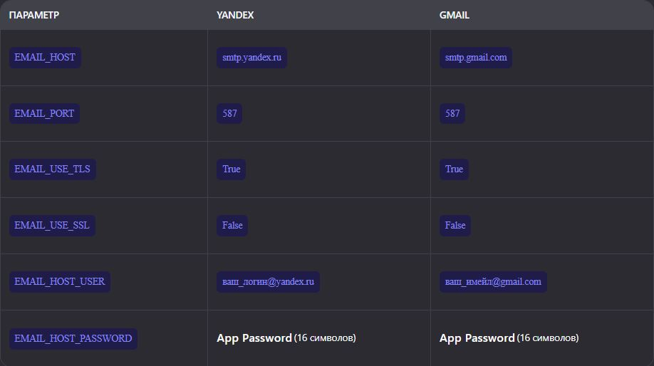
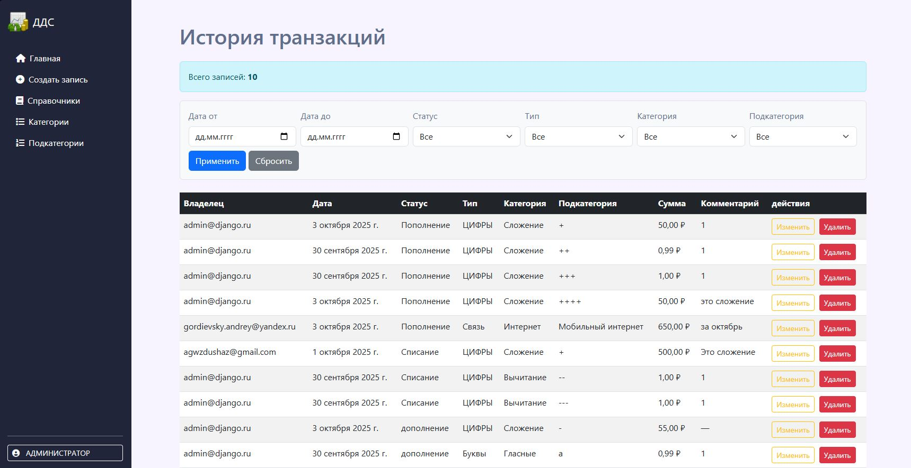
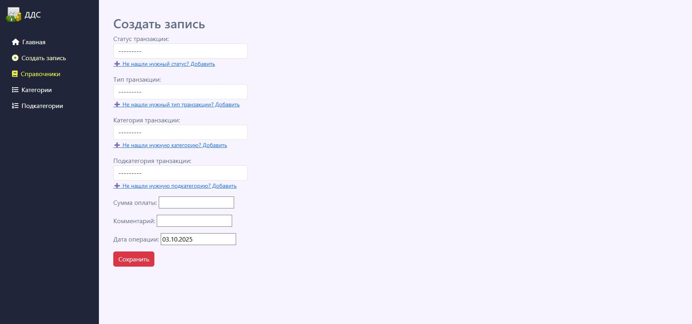
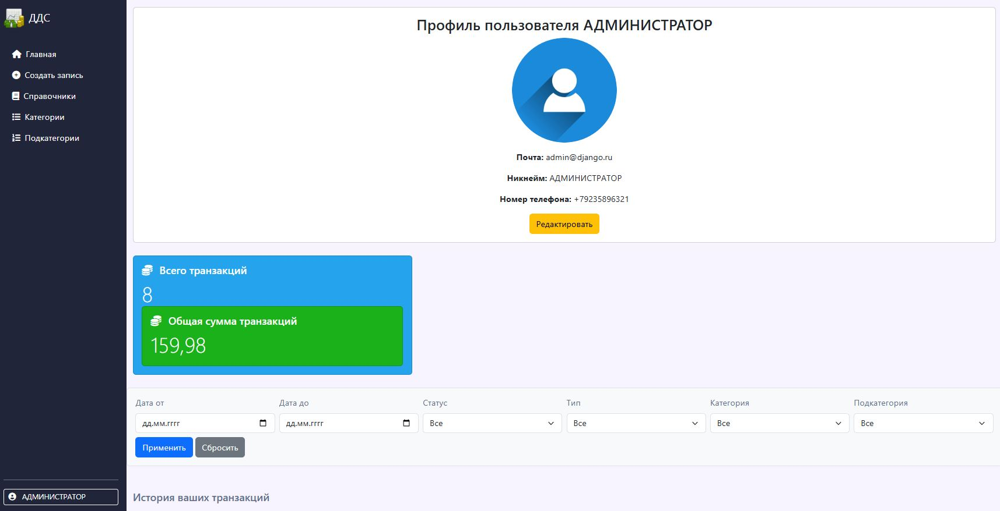
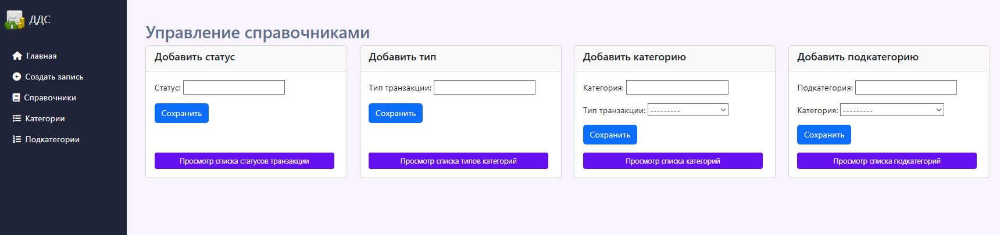

#  Веб-сервис для управления движением денежных средств (ДДС)

# 🔖 Описание проекта:

ДДС (движение денежных средств) — это процесс учета, управления и анализа
поступлений и списаний денежных средств компании или частного лица.

# 🔧 Установка компонентов:


1. *Создайте проект и скопируйте содержимое с GitHub:*
```
https://github.com/StreetShiffter/Firs_IT_Company-Manage_cash.git
cd firs-it-company-manage-cash
```
2. *Установи Poetry (если ещё не установлен):*

🖥 Linux / macOS / WSL:

```curl -sSL https://install.python-poetry.org | python3 -```

🖥 Windows (PowerShell):

```(Invoke-WebRequest -Uri 'https://install.python-poetry.org' -UseBasicParsing).Content | python -```

🔄 После установки перезагрузи терминал и проверь

```poetry --version```

3. *Установи зависимости*

```poetry install```

 Установите инструменты для реализации сервиса:


[]( https://www.djangoproject.com/ )
[]( https://pypi.org/project/python-dotenv/ )
[]( https://pypi.org/project/psycopg2/ )
[]( https://pypi.org/project/Pillow/ )
[]( https://pypi.org/project/ipython/ )


КОМАНДЫ ДЛЯ ЗАПУСКА ФРЕЙМВОРКА И ПРИЛОЖЕНИЯ
```
poetry add django # Установка django
poetry add pillow # Установка библиотеки для работы с изображениями
poetry add dotenv # Установка библиотеки для работы с чувствительными данными
poetry add ipython # Установка библиотеки для работы с чувствительными данными
poetry add psycopg2 # Установка инструмента для работы с ORM

poetry add --dev flake8 mypy isort black # Eстановка всех dev зависимостей 

django-admin startproject config . # Старт нового проекта
django-admin startproject myproject # Старт нового приложения

python manage.py createsuperuser # дать суперпользователя для админки.
При выполнении этой команды необходимо указать имя пользователя и пароль.
Адрес электронной почты является опциональным параметром.

python manage.py shell -i ipython #Запуск DJANGO SHELL

```
🔄 ОБНОВЛЕНИЕ ДАННЫХ

ВНИМАНИЕ!!!
В проекте есть файл *.env_example* и скопировать все поля в новый файл *.env*
Необходимо сгенерировать новый ключ SECRET_KEY через командную строку и вставить ключ в нужное поле

```
python -c "from django.core.management.utils import get_random_secret_key; print(get_random_secret_key())"
```
💽 РАБОТА С БД
Необходимо создать новую БД через СУБД *PostgreSQL* и внести новые данные в .env
До работы с приложением примените миграции в вашу БД:

```
python manage.py migrate
```

☁️ Работа с почтой
Необходимо создать приложение почты в вашем Gmail или ЯндексПочта почтовом ящике и внести данные в .env



🛠️ Работа с приложением:
1. Для работы с вьюшками в основном приложении найдите папку *views.py*? создайте модуль и реализуйте контроллер.
2. Импортируйте новый контроллер в модуле *__init__.py* и импортируйте контроллер
3. Пропишите путь контроллера в модуле *urls.py*
4. При необходимости привяжите к контроллеру шаблон HTML и положите в папку по пути *templates/manage_cash*
Образец шаблона:
```


ИМЯ ВКЛАДКИ



ОСНОВНОЙ БЛОК С КОНТЕНТОМ
           +
<!-- Модальное окно для добавления Подкатегории -->




    <script>
ФУНКЦИОНАЛ JS
    </script>


```
5. При работе с приложением *Users* повторяйте пункты 1-4
❗ в приложении пользователей все контроллеры лежат в модуле *views.py*
# ✒️ Использование API
ВНИМАНИЕ - НА ДАННЫЙ МОМЕНТ НЕ РЕАЛИЗОВАН DJANGO RAST FRAMEWORK
Для POSTMAN можно выполнять фильтрацию и поиск, если они указаны в полях вьюшки-эндпоинте:
```
http://localhost:8000/users/payment/ - основа
http://localhost:8000/users/payment/?ordering=payment_date=false - сортировка по убыванию(указываем функцию и по какому полю из вьюшки)
http://localhost:8000/users/payment/?payment_method=transfer - фильтрация (можно не указывать поле filterset) 
```

```
️ ВАЖНО ⚠️

python manage.py runserver 8080 # Запуск сервера
CTRL+С # Отключение сервера
```

Postman коллекция
Для удобства тестирования API предоставлена коллекция Postman:

📥 Скачать Postman Collection

Или импортируйте по ссылке (если опубликовано в Postman Cloud):

🔗 Открыть в Postman

💡 Совет: Импортируйте коллекцию в Postman → "Import" → "Link" или "File". 
### 🌐 Пример страниц:
*Главная страница*





#### 🔍СТРУКТУРА ПРОЕКТА
```
📁 Firs_IT_Company-Manage_cash/
├── 📁 config/                     # Настройки Django
│   ├── 📁 manage_cash/            # Основное приложение
│   │   ├── 📁 migrations/         # Миграции БД
│   │   ├── 📁 templates/          # Шаблоны HTML
│   │   ├── 📁 views/              # Модули работы со справочниками, главной страницей и AJAX-модули
│   │   │   ├── 📄 AJAX_module.py
│   │   │   ├── 📄 create_directory.py
│   │   │   ├── 📄 head_directory.py
│   │   │   ├── 📄 list_category.py
│   │   │   ├── 📄 list_status.py
│   │   │   ├── 📄 list_subcategory.py
│   │   │   └── 📄 list_type.py
│   │   ├── 📄 __init__.py
│   │   ├── 📄 admin.py
│   │   ├── 📄 apps.py
│   │   ├── 📄 forms.py
│   │   ├── 📄 models.py
│   │   ├── 📄 tests.py
│   │   └── 📄 urls.py
│   └── 📄 __init__.py
│
├── 📁 users/                      # Приложение пользователей
│   ├── 📁 migrations/
│   ├── 📁 templates/
│   ├── 📄 __init__.py
│   ├── 📄 admin.py
│   ├── 📄 apps.py
│   ├── 📄 forms.py
│   ├── 📄 models.py
│   ├── 📄 tests.py
│   ├── 📄 urls.py
│   ├── 📄 validators.py
│   └── 📄 views.py
│
├── 📁 media/                      # Загрузка файлов
│   └── 📁 user_avatars/           # Аватары пользователей
│
├── 📁 static/                     # Статика
│   ├── 📁 css/
│   ├── 📁 js/
│   └── 📁 manage_cash/
│
├── 📄 .env                       # Переменные окружения (не коммитится!)
├── 📄 .env_example               # Шаблон .env
├── 📄 .gitignore                 # Что игнорировать в Git
├── 📄 .flake8                    # Настройки линтера
├── 📄 Icon.md                    # Иконка проекта (если есть)
├── 📄 manage.py                  # Менеджер Django
├── 📄 poetry.lock                # Зависимости Poetry
├── 📄 pyproject.toml             # Конфигурация Poetry
└── 📄 README.md                  # Этот файл 
```
📄 Лицензия
Этот проект лицензирован по MIT License — подробнее см. файл LICENSE.